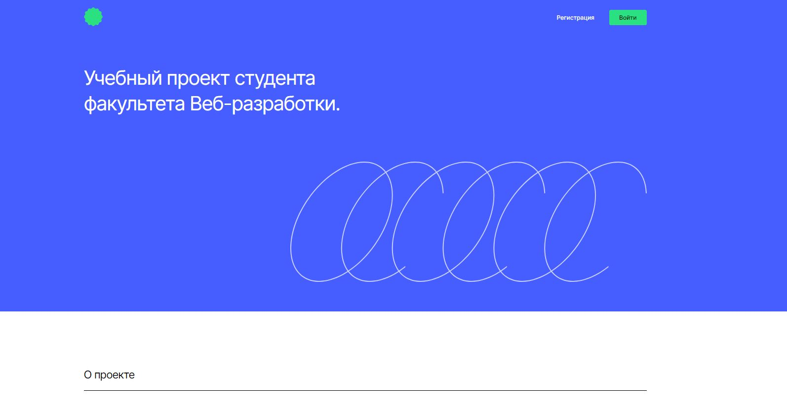
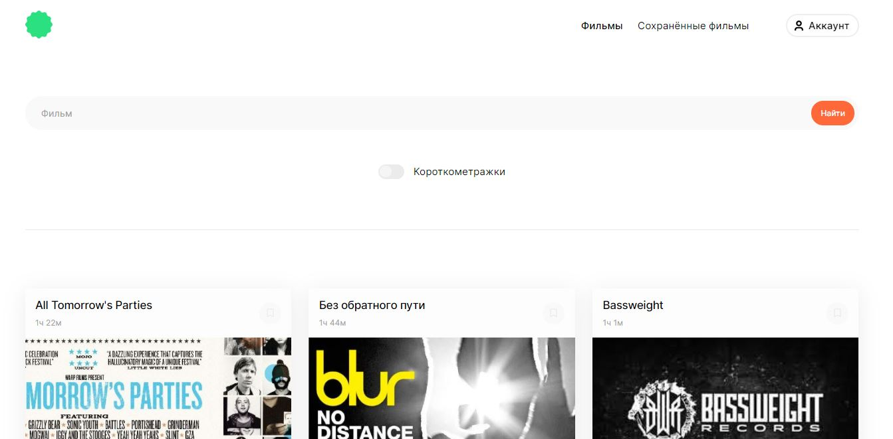
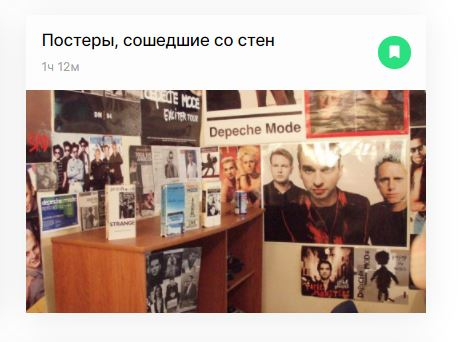

EN and RUS description

# Movies explorer website :movie_camera:  

## Demo link:  

You can visit homepage of the app here: https://movies-explorer-frontend-three.vercel.app/  

## Table of Content:  

* About The App   
* Technologies  
* Setup  
* Status  

## About The App  

  

First of all, you will get on homepage, where you can see some information about project and developer.  

  

You can get to login page by click on green button at the top right part of the screen. If you are authorized, you will be redirected to page with search form. Enter movie name to the search field and press search button to get list of appropriate movies.  

  

You can save movies also by click on save icon at the top right part of card with movie.  

  

Also you can change some personal details in your account page.  

  

## Technologies  

React, Express, MongoDB  

## Setup  

First of all, you need to run back-end part (code and instructions can be found here: https://github.com/EvgeniiaZu8ova/movies-explorer-api). Then:

* Download or clone the repository  
* Run ```npm install```  
* Run ```npm start```  

At the same time both back-end and front-end parts should be run.  

## Status  

This app is available in Russian language only at the moment. Also you can get acess to full set of options only if you run back-end and front-end on your local machine.


# Сайт с поиском фильмов :movie_camera:  

## Ссылка:  

Домашнюю страницу сайта можно посмотреть здесь: https://movies-explorer-frontend-three.vercel.app/  

## Содержание:  

* О приложении   
* Технологии  
* Установка  
* Статус  

## О приложении    

  

В первую очередь, вы попадаете на домашнюю страницу с информацией о приложении и разработчике.  

  

Вы можете перейти на страницу авторизации, кликнув на зелёную кнопку в верхней правой части страницы. Если вы авторизованы, вы будете автоматически перенаправлены на страницу поиска. Введите название фильма в поле поиска и нажмите кнопку "Найти". 

  

Вы можете сохранить себе фильм, кликнув на иконку сохранения в правой верхней части карточки с фильмом.  

  

В личном кабинете вы можете изменить некоторые персональные данные.  

  

## Технологии  

React, Express, MongoDB  

## Установка  

Прежде всего, вам необходимо запустить бэкенд-часть приложения (код и инструкции для бэкенда вы найдёте здесь: https://github.com/EvgeniiaZu8ova/movies-explorer-api). Затем:

* Скачайте или клонируйте репозиторий  
* Выполните команду ```npm install```  
* Выполните команду ```npm start```  

Для корректной работы приложения у вас должны быть запущены и бэкенд и фронтенд.  

## Status  

В настояший момент у приложения есть только русскоязычная версия. Также стоит учесть, что полный функционал приложения будет доступен только при запуске бэкенда и фронтенда локально на вашем компьютере.


